1. **Nombres y apellidos:** Justo Antonio Garrido Herrador
2. **Fecha:** entrega 19-11-2020
3. **Laboratorio / Demos**: UtilizacionAzureCLIparaCrearBorrarMV.md
4. **Resumen del Ejercicio:** Crear una máquina virtual linux en Azure ejecutando Apache y sirviendo una página web de prueba.
1. **Objetivos**: 
   
      1.  ¡¡¡. 
      
         **Pasos**: 
      
         1.   ¡¡¡.
6. **Dificultad o problemas presentados y como se resolvieron:** ¡¡¡.
7. **Detalles de la entrega**:
   
      1. **Evidencias capturas de pantalla en carpeta**: **Capturas**. ( ruta: ...\\CFTIC610-AZ-900T1-MS-Azure-Fundamentals\20201118 Tarea 1 Módulos AZ-900CFTIC\Capturas). Índice de las capturas en este propio documento, a continuación.

------

## EXPLICACIÓN DE LAS CAPTURAS DE PANTALLA:

Creación del grupo de recursos:

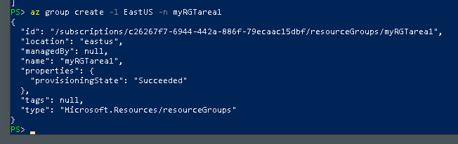

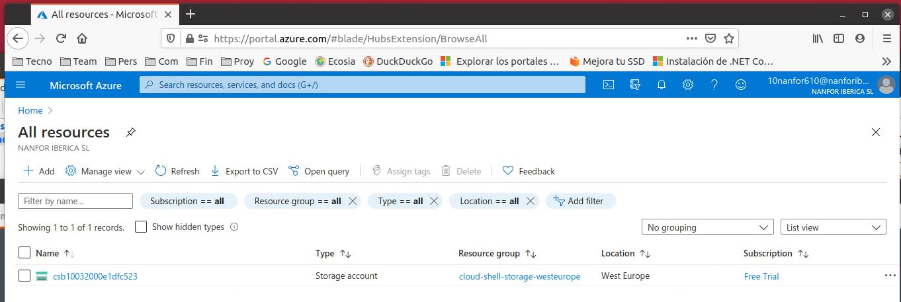

Creación de la VM Linux:

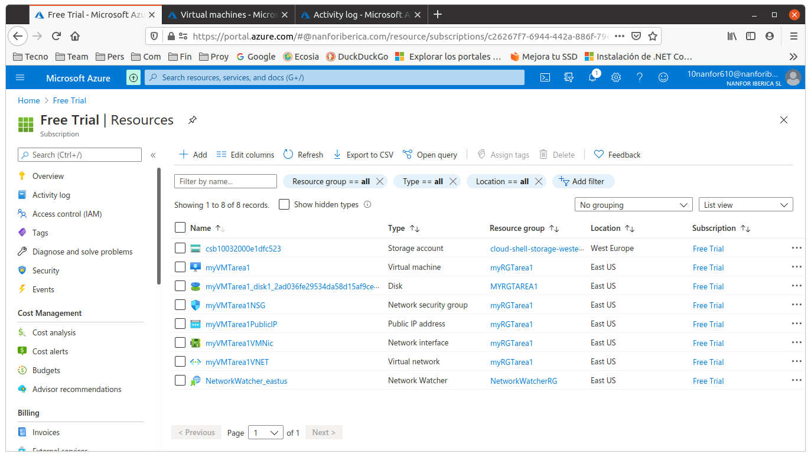

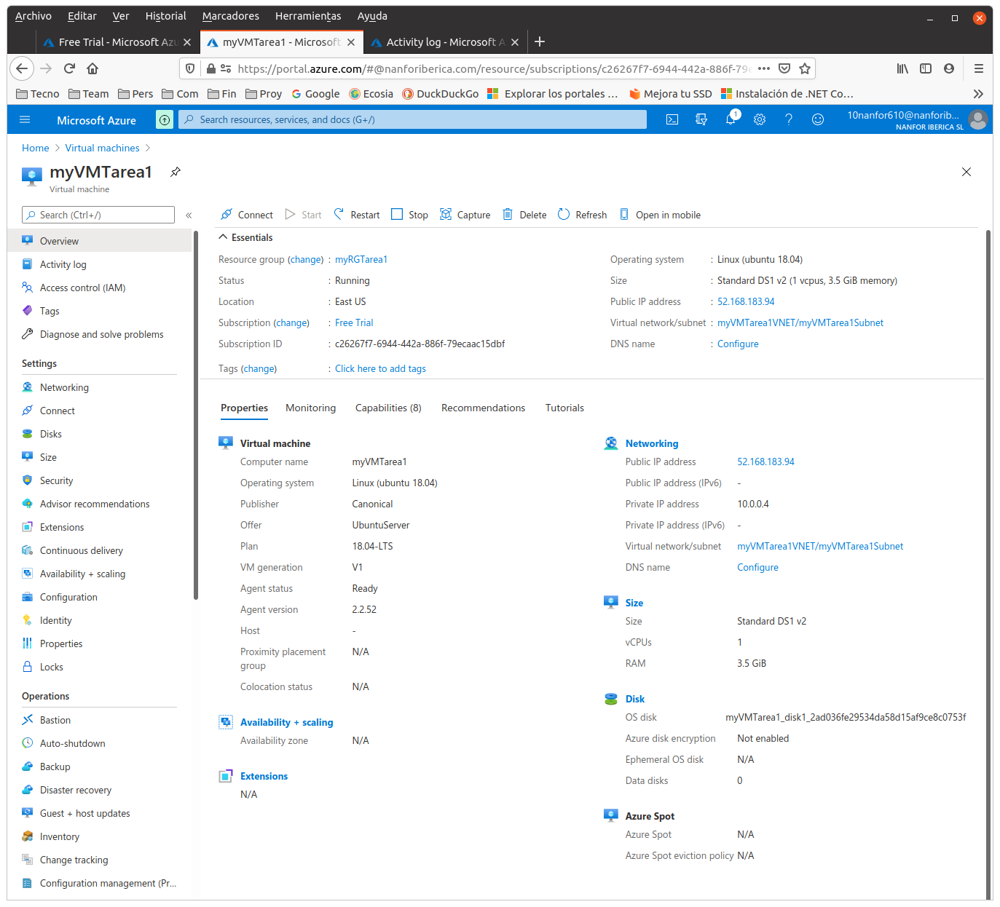

No pude entrar con el password puesto en la orden de creación y lo resetee, poniéndole el mismo valor:

Conectarse por ssh:

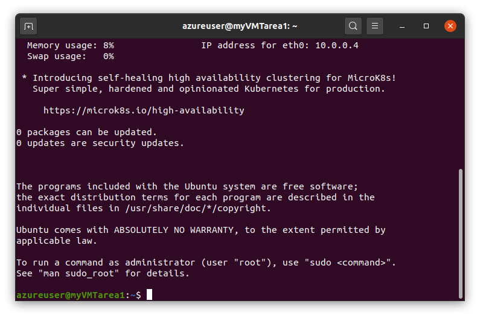

Después de actualizar, upgradear,instalar y verifcar apache:

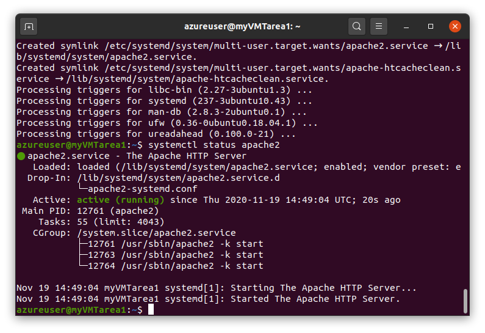

Vamos a abrir el puerto 80 en el Network Security Group de Azure:

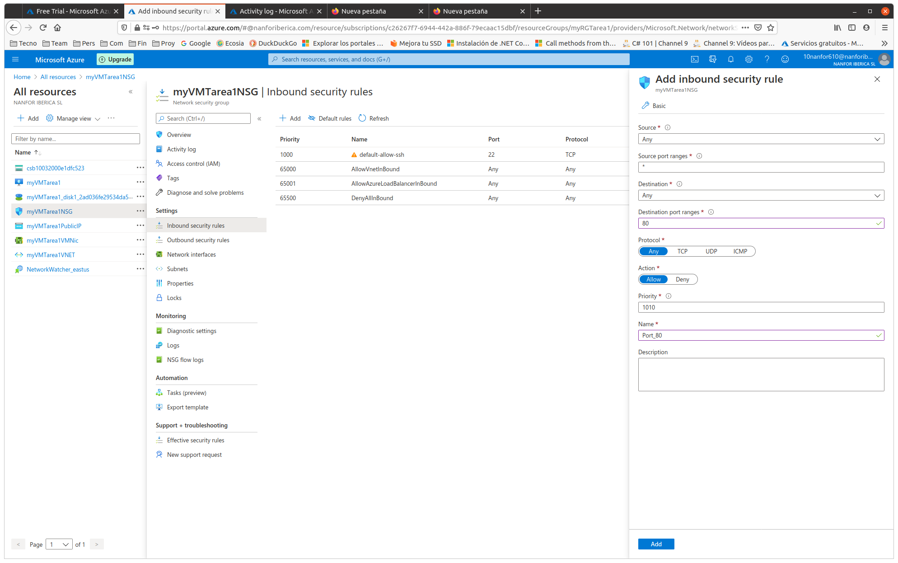

Realizamos alguna modificación en la página web inicial: 

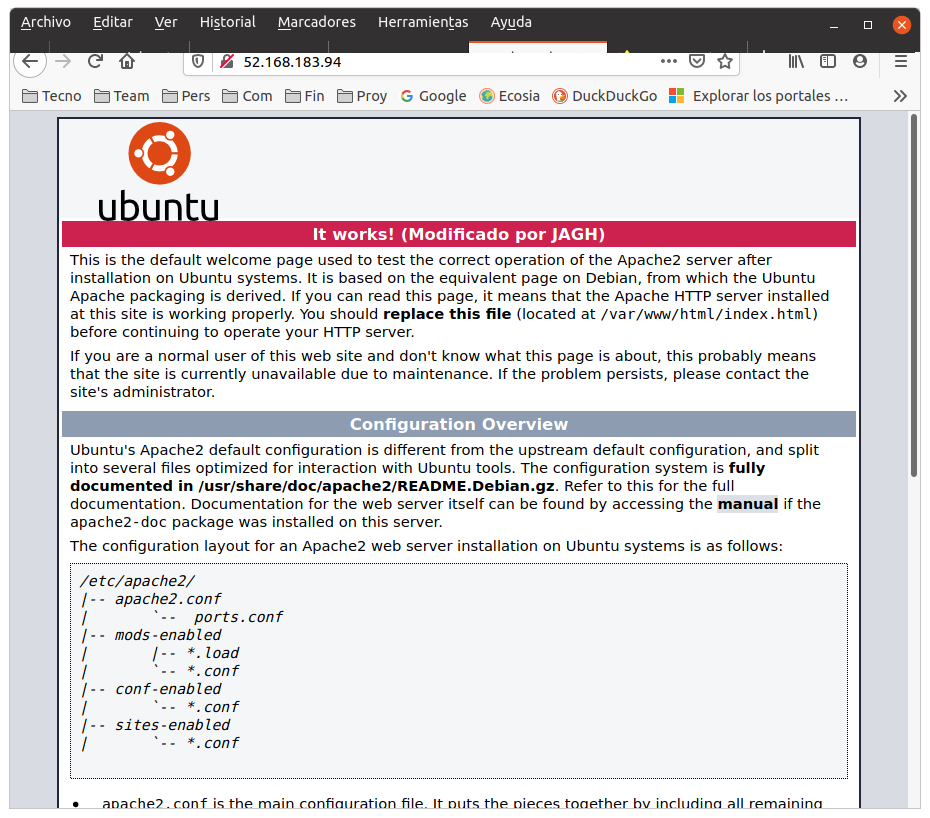

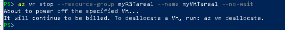
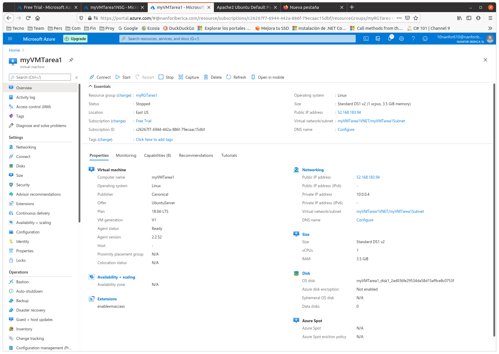

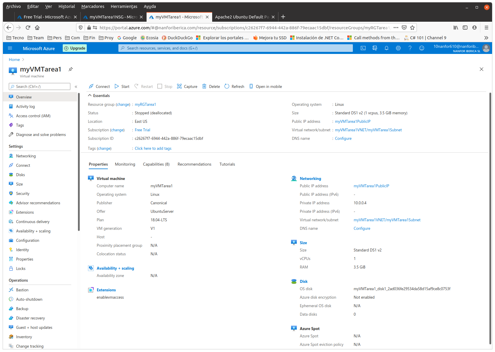
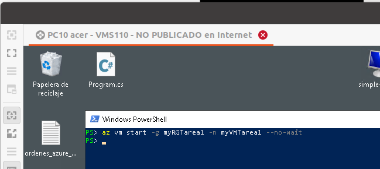
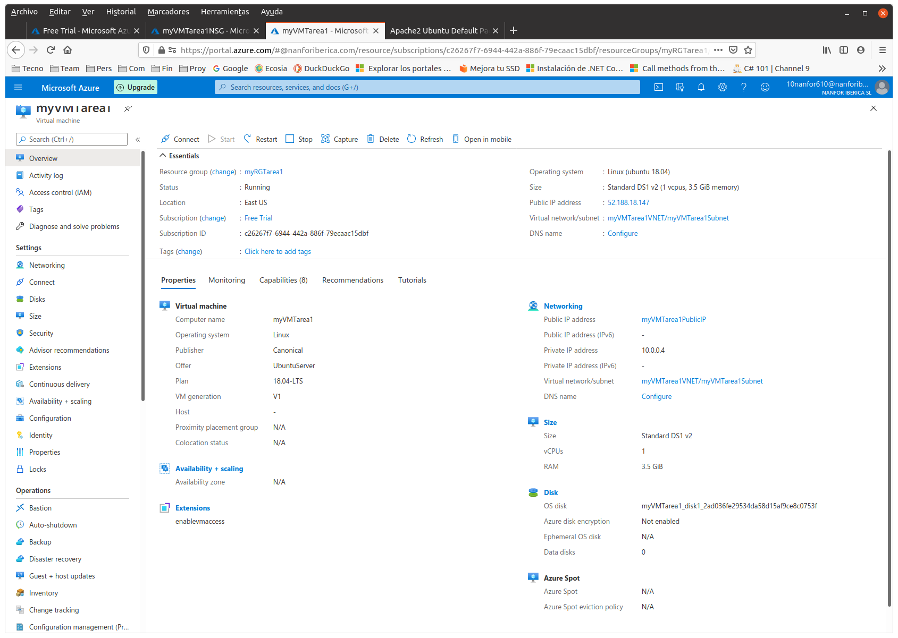
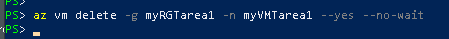
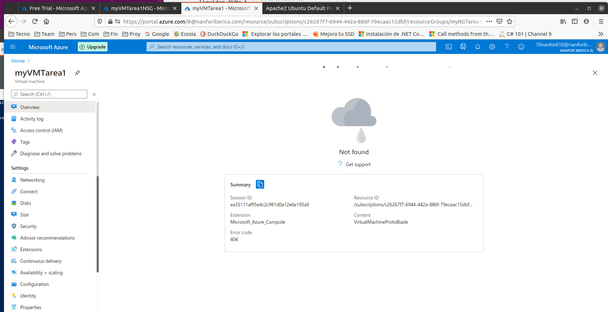
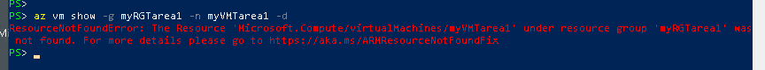
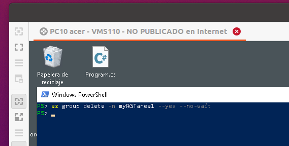
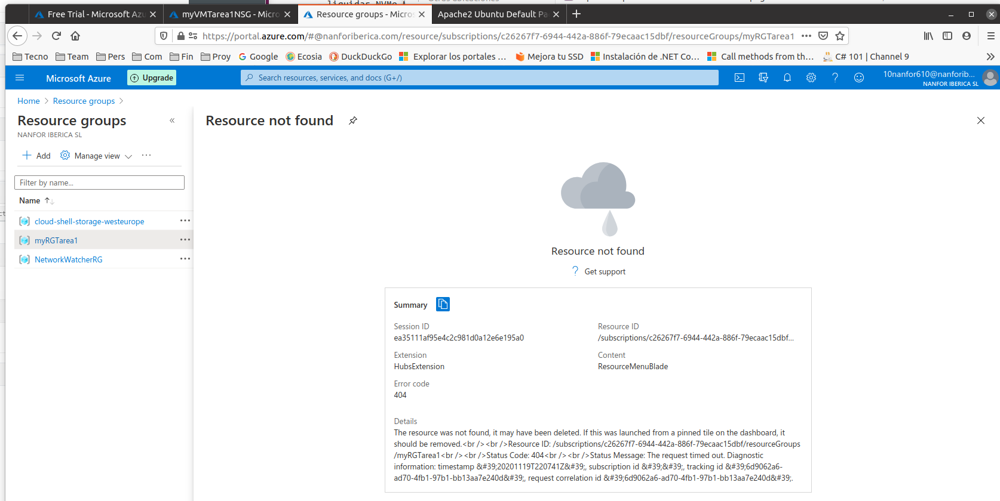
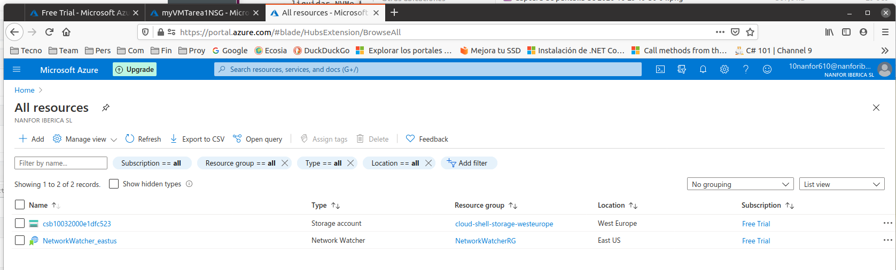
